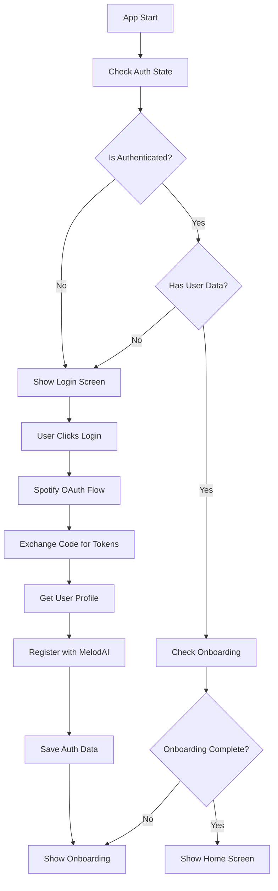

# Authentication System Documentation

## Overview

This authentication system provides a complete Spotify OAuth integration with secure token storage, session management, and MelodAI service integration for your React Native Expo app.

## Features

- ✅ **Spotify OAuth 2.0 Flow** - Complete authorization code flow with PKCE
- ✅ **Secure Token Storage** - Uses expo-secure-store for sensitive data
- ✅ **Automatic Token Refresh** - Handles token expiry and refresh automatically
- ✅ **Session Persistence** - Maintains user sessions across app restarts
- ✅ **MelodAI Integration** - Registers users with MelodAI service after Spotify auth
- ✅ **Comprehensive Error Handling** - Custom error types with detailed error codes
- ✅ **Production Ready** - Robust error handling, validation, and logging

## Architecture

### Core Components

1. **SpotifyAuthService** (`services/spotify/auth.ts`)

   - Singleton service handling all Spotify authentication
   - Token management and refresh
   - User data storage and retrieval

2. **AuthStore** (`store/auth.ts`)

   - Zustand store for authentication state management
   - Syncs with secure storage
   - Provides reactive auth state to components

3. **Storage Utilities** (`services/storage/index.ts`)

   - Abstraction layer over expo-secure-store
   - Batch operations and type-safe storage
   - Centralized storage key management

4. **LoginScreen** (`src/screens/auth/LoginScreen.tsx`)
   - Beautiful UI for Spotify authentication
   - Error handling and loading states
   - Automatic navigation after successful login

## Authentication Flow



## Usage

### Checking Authentication Status

```typescript
import { useAuthStore } from '@store/auth';

function MyComponent() {
  const { isAuthenticated, user, isLoading } = useAuthStore();

  if (isLoading) return <LoadingSpinner />;
  if (!isAuthenticated) return <LoginPrompt />;

  return <WelcomeMessage user={user} />;
}
```

### Manual Login/Logout

```typescript
import { useAuthStore } from '@store/auth';

function AuthButtons() {
  const { login, logout, isLoading } = useAuthStore();

  return (
    <View>
      <Button onPress={login} disabled={isLoading}>
        Login
      </Button>
      <Button onPress={logout} disabled={isLoading}>
        Logout
      </Button>
    </View>
  );
}
```

### Using the Auth Service Directly

```typescript
import { SpotifyAuthService } from '@services/spotify';

const authService = SpotifyAuthService.getInstance();

// Check if user is authenticated
const isAuth = await authService.isAuthenticated();

// Get current auth state
const authState = await authService.getAuthState();

// Get current access token (automatically refreshes if needed)
const token = await authService.getAccessToken();
```

## Storage Keys

All sensitive data is stored using expo-secure-store with the following keys:

```typescript
export const STORAGE_KEYS = {
  ACCESS_TOKEN: 'spotify_access_token',
  REFRESH_TOKEN: 'spotify_refresh_token',
  TOKEN_EXPIRY: 'spotify_token_expiry',
  USER_DATA: 'spotify_user_data',
  AUTH_DATA: 'melodai_auth_data',
  ONBOARDING_COMPLETED: 'onboarding_completed',
  SELECTED_AGENT: 'selected_agent_id',
};
```

## Error Handling

The system uses custom `AuthError` class for better error handling:

```typescript
import { AuthError } from '@services/spotify';

try {
  await authService.refreshAccessToken();
} catch (error) {
  if (error instanceof AuthError) {
    switch (error.code) {
      case 'REFRESH_TOKEN_INVALID':
        // Redirect to login
        break;
      case 'CONFIG_ERROR':
        // Show configuration error
        break;
      default:
      // Handle generic auth error
    }
  }
}
```

### Error Codes

| Code                     | Description                                     |
| ------------------------ | ----------------------------------------------- |
| `CONFIG_ERROR`           | Missing configuration (Client ID, Secret, etc.) |
| `REQUEST_CREATION_ERROR` | Failed to create OAuth request                  |
| `AUTHORIZATION_ERROR`    | OAuth authorization failed                      |
| `TOKEN_EXCHANGE_ERROR`   | Failed to exchange code for tokens              |
| `STORAGE_ERROR`          | Error saving/retrieving from secure storage     |
| `REFRESH_TOKEN_MISSING`  | No refresh token available                      |
| `REFRESH_TOKEN_INVALID`  | Refresh token is invalid or expired             |
| `REFRESH_ERROR`          | Token refresh failed                            |
| `LOGOUT_ERROR`           | Error during logout                             |

## Configuration

### Environment Variables

Ensure these environment variables are set:

```env
EXPO_PUBLIC_SPOTIFY_CLIENT_ID=your_spotify_client_id
EXPO_PUBLIC_SPOTIFY_CLIENT_SECRET=your_spotify_client_secret
EXPO_PUBLIC_SERVICE_URL=your_melodai_service_url
```

### Spotify App Settings

1. **Redirect URI**: `spoti://auth/callback`
2. **Bundle ID**: Must match your app's bundle identifier
3. **Scopes**: Configured in `types/spotify.ts`

```typescript
export const SPOTIFY_SCOPES = [
  'user-read-recently-played',
  'user-read-private',
  'user-read-email',
  'user-top-read',
  'playlist-read-private',
  'playlist-read-collaborative',
  'streaming',
  'user-modify-playback-state',
];
```

## Security Considerations

1. **Secure Storage**: All tokens and sensitive data stored with expo-secure-store
2. **Token Expiry**: Automatic token refresh 1 minute before expiry
3. **Error Boundaries**: Proper error handling prevents app crashes
4. **Input Validation**: All inputs validated before processing
5. **Logout on Error**: Automatic logout on critical auth errors

## Troubleshooting

### Common Issues

1. **"CLIENT_ID not configured"**

   - Ensure `EXPO_PUBLIC_SPOTIFY_CLIENT_ID` is set in your environment

2. **"Failed to exchange authorization code"**

   - Check that redirect URI matches exactly in Spotify app settings
   - Verify client secret is correct

3. **"Refresh token is invalid"**

   - User needs to login again (tokens may have been revoked)

4. **App stuck on loading screen**
   - Check console for initialization errors
   - Verify all required environment variables are set

### Debug Mode

Enable detailed logging by adding this to your app:

```typescript
// In development
if (__DEV__) {
  console.log('Auth State:', await authService.getAuthState());
}
```

## Production Deployment

1. **Environment Variables**: Ensure all production env vars are set
2. **Bundle ID**: Must match Spotify app settings exactly
3. **SSL**: Ensure all API endpoints use HTTPS
4. **Error Monitoring**: Consider adding crash reporting (Sentry, Bugsnag)
5. **Testing**: Test complete auth flow on physical devices

## API Reference

### SpotifyAuthService

| Method                 | Description                | Returns                                 |
| ---------------------- | -------------------------- | --------------------------------------- |
| `getInstance()`        | Get singleton instance     | `SpotifyAuthService`                    |
| `getAuthRequest()`     | Create OAuth request       | `AuthRequest`                           |
| `handleAuthResponse()` | Handle OAuth callback      | `Promise<SpotifyTokenResponse \| null>` |
| `saveTokens()`         | Save tokens to storage     | `Promise<void>`                         |
| `saveUser()`           | Save user data to storage  | `Promise<void>`                         |
| `getUser()`            | Get user data from storage | `Promise<SpotifyUser \| null>`          |
| `getAccessToken()`     | Get valid access token     | `Promise<string \| null>`               |
| `refreshAccessToken()` | Refresh expired token      | `Promise<string \| null>`               |
| `logout()`             | Clear all auth data        | `Promise<void>`                         |
| `isAuthenticated()`    | Check auth status          | `Promise<boolean>`                      |
| `getAuthState()`       | Get complete auth state    | `Promise<AuthState>`                    |

### AuthStore

| Property/Method      | Description                | Type                  |
| -------------------- | -------------------------- | --------------------- |
| `isAuthenticated`    | Current auth status        | `boolean`             |
| `user`               | Current user data          | `SpotifyUser \| null` |
| `isLoading`          | Loading state              | `boolean`             |
| `error`              | Current error message      | `string \| null`      |
| `login()`            | Perform login check        | `Promise<boolean>`    |
| `logout()`           | Logout user                | `Promise<void>`       |
| `checkAuth()`        | Check auth status          | `Promise<boolean>`    |
| `refreshAuthState()` | Refresh state from storage | `Promise<void>`       |

## Contributing

When contributing to the auth system:

1. **Maintain Security**: Never log sensitive data in production
2. **Error Handling**: Always use try/catch blocks and custom error types
3. **Testing**: Test on physical devices with various network conditions
4. **Documentation**: Update this README for any API changes
5. **Backward Compatibility**: Maintain compatibility with existing storage

---

For questions or issues, please refer to the project's main README or create an issue in the repository.
